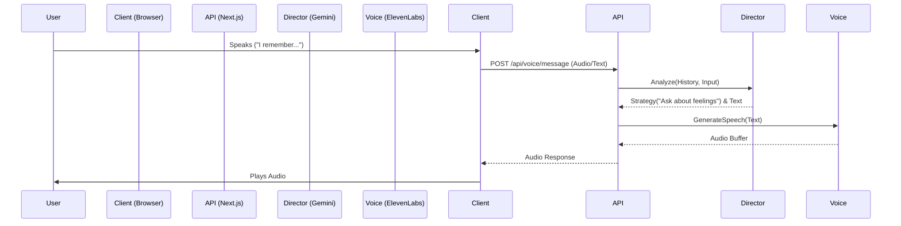
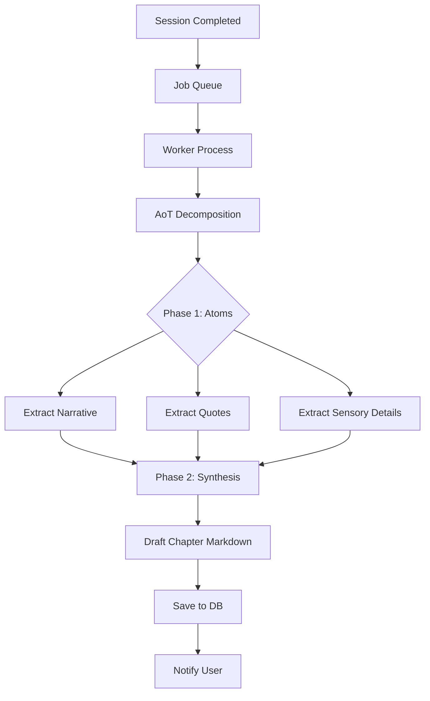

# 04. System Architecture

## 4.1 High-Level Overview

Recall follows a **Hexagonal Architecture (Ports & Adapters)** pattern to ensure strict separation of concerns, testability, and independence from external frameworks. The core business logic resides in the center, isolated from the "Infrastructure" (Database, AI APIs, Web Framework).

### **Architectural Layers**

1.  **Core Domain (Inner Layer)**
    -   Contains pure business entities (`User`, `Chapter`, `Session`).
    -   Contains domain invariants and business rules.
    -   *Dependency Rule:* Depends on nothing.

2.  **Application Layer (Middle Layer)**
    -   Contains Use Cases (`StartSessionUseCase`, `GenerateChapterUseCase`).
    -   Orchestrates the flow of data between the Domain and the outside world.
    -   Defines `Ports` (Interfaces) that infrastructure must implement.
    -   *Dependency Rule:* Depends only on Domain.

3.  **Infrastructure Layer (Outer Layer)**
    -   Contains Adapters (`GeminiService`, `DrizzleRepository`, `NextJS API`).
    -   Implements the Ports defined in the Application layer.
    -   *Dependency Rule:* Depends on Application and Domain.

---

## 4.2 Component Responsibilities

### **Frontend (Next.js)**
-   **Responsibility:** Rendering UI, capturing audio, playing audio, managing local state.
-   **Communication:** Communicates with Backend via REST API and WebSockets (for voice).

### **Backend (Next.js Server Actions / API Routes)**
-   **Responsibility:** Authentication, request validation, Use Case execution.
-   **Dependency Injection:** Uses a DI Container to resolve dependencies for Use Cases.

### **Database (PostgreSQL + Drizzle)**
-   **Responsibility:** Persistent storage of relational data (Users, Sessions) and JSONB documents (Entities, Metadata).

### **AI Services (Vertex AI + ElevenLabs)**
-   **Gemini (Vertex AI):**
    -   "The Director": Conversation strategy and goal setting.
    -   "The Biographer": Content generation and AoT decomposition.
    -   "The Analyst": Image analysis (Vision).
-   **ElevenLabs:**
    -   TTS (Text-to-Speech) with emotional control.
    -   Voice orchestration (in some flows).

### **Vector Store (Pinecone)**
-   **Responsibility:** Semantic search for long-term memory retrieval ("Recall").

---

## 4.3 Data Flow Diagrams

### **Voice Interaction Loop**

### **Chapter Generation Pipeline (Async)**

