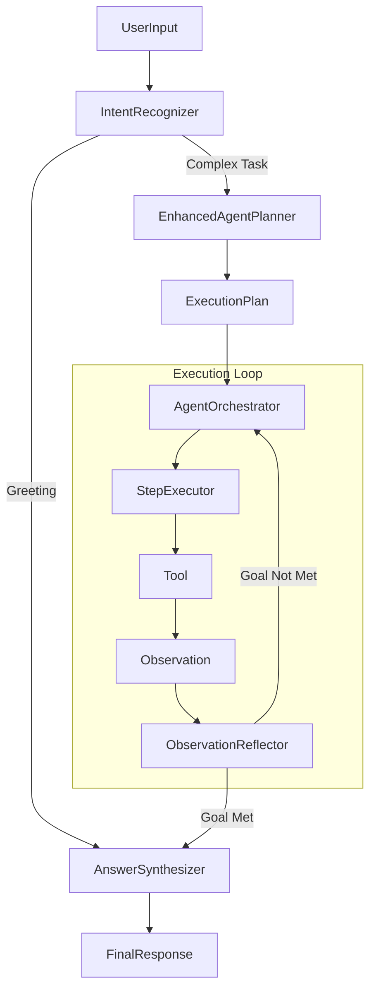

# Recall Agentic Architecture

## Overview
This document describes the redesign of Recall's AI core into a modular, observable, and safe agentic system.

## Core Components

### 1. Agent Orchestrator (`AgentOrchestrator.ts`)
The central "brain" that manages the lifecycle of a request.
- **Phases**:
  1. **Intent Recognition**: Classifies user input.
  2. **Planning (AoT)**: Generates a step-by-step Execution Plan.
  3. **Execution Loop (ReAct)**: Executes steps, observes results, reflects.
  4. **Synthesis**: Generates the final answer.

### 2. Primitives (`AgentPrimitives.ts`)
Strict interfaces that define the data flowing through the system.
- `RecognizedIntent`: Classification result.
- `ExecutionPlan`: Structured steps to achieve a goal.
- `PlannedStep`: A single atomic action.
- `ProcessedObservation`: The result of an action + insight.
- `ReflectionResult`: Verification of progress.

### 3. Sub-Agents / Modules
- **IntentRecognizer**: Uses LLM to determine acting mode (Conversational vs. Task).
- **EnhancedAgentPlanner**: Breaks down complex goals into dependent steps.
- **StepExecutor**: Handles tool execution, error recovery, and token tracking.
- **ObservationReflector**: Validates if the goal is met or if re-planning is needed.
- **AnswerSynthesizer**: converting structured findings into natural language.

### 4. Context Management (`ContextManager.ts`)
- Implements a budget-aware sliding window.
- Prioritizes System Prompts > Relevant Memories > Recent History.
- Ensures the agent never exceeds token limits.

## Flow Diagram

## How to Extend
- **New Tools**: Add to the `tools` array passed to the Orchestrator.
- **New Intents**: Add to `IntentType` enum and update `IntentRecognizer` prompt.
- **New Planning Logic**: Modify `EnhancedAgentPlanner`.

## Verification
Run `npx tsx tests/verify_agent.ts` to validate the core flow.
