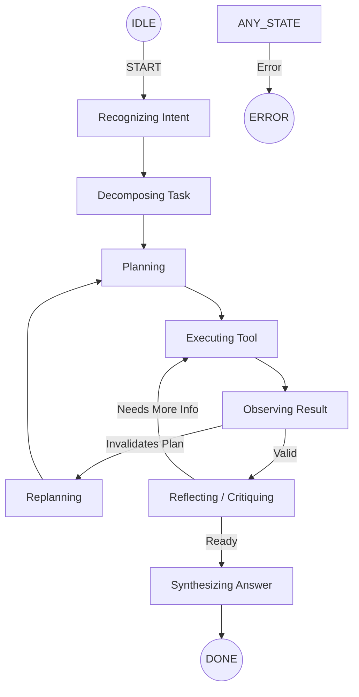
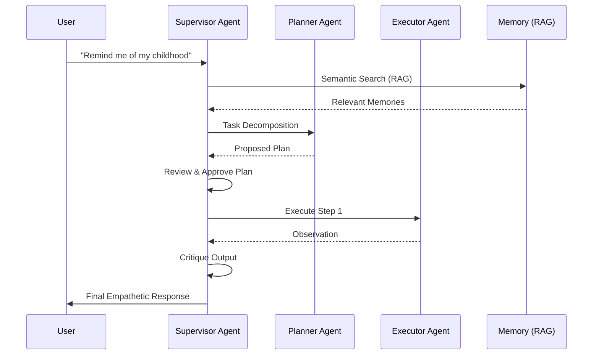

# Recall Agentic AI Architecture

The Recall Agentic AI Architecture is designed as a modular, safe, and adaptive system for creating empathetic AI companions. It moves beyond simple prompt-response loops to a structured, state-machine driven reasoning engine.

## Core Design Principles

1.  **Reasoning as a State Machine**: Every agent follows a deterministic finite state machine (FSM) to ensure behavior is predictable and auditable.
2.  **Tiered Memory**: Memory is categorized into Short-Term (working), Long-Term (semantic), and Episodic (interaction outcomes) tiers.
3.  **Adaptive Routing**: Intelligence is dynamically routed between models (e.g., Gemini Flash vs. Pro) based on task complexity.
4.  **Empathy First**: Cognitive and emotional analysis is baked into every step of the reasoning process.

---

## Agent State Machine (FSM)

Each `EnhancedReActAgent` operates through a defined set of phases. This separation allows for "thinking before acting" and "reflecting before answering."

---

## Multi-Agent Orchestration

Complex workflows are handled by a **Supervisor-Led Pipeline**. The `SupervisorAgent` acts as a quality gate, reviewing the plans and outputs of specialized agents.

---

## Tiered Memory Architecture

Recall uses a hybrid memory management system to balance immediate context with long-term knowledge.

| Tier | Type | Persisted | Description |
| :--- | :--- | :--- | :--- |
| **Short-Term** | Working | No | Volatile data for the current sub-task only. |
| **Middle-Term** | Conversation | Yes (SQL/NoSQL) | The recent turns of the current session. |
| **Long-Term** | Semantic | Yes (Vector DB) | High-importance facts and biography extracted over time. |
| **Episodic** | Outcomes | Yes (Vector DB) | Summarized results of previous successful tasks. |

---

## Performance & Cost Optimization

Optimization is handled at three layers:
1.  **Model Selection**: Using the `ModelRouter` to pick the cheapest model capable of the task.
2.  **Embedding Caching**: In-memory caching of vector embeddings to avoid redundant API calls.
3.  **Context Budgeting**: Priority-based pruning of the prompt context using `ContextBudgetManager`.
4.  **Stable Prefixes**: Identifying non-volatile parts of the prompt to enable LLM-side context caching.
