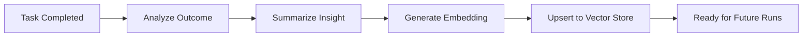

# Memory & RAG Strategy

Recall implements a multi-modal, persistent memory system that enables long-term relationships and progressive learning.

## Memory Types

| Type | Persistence | Description |
| :--- | :--- | :--- |
| **Working** | Transient | Short-term storage for variables or values used within a single complex task. |
| **Short-Term** | Session | The context window of the current conversation. |
| **Semantic** | Permanent | Vector-indexed facts about the user's life, preferences, and relationships. |
| **Episodic** | Permanent | High-level summaries of significant interactions or solved tasks. |

## The RAG Pipeline

RAG (Retrieval-Augmented Generation) is executed at the start of every agent session:

1.  **Query Generation**: The agent extracts a search query from the user's input.
2.  **Vector Search**: The query is embedded using `GoogleEmbeddingAdapter` and searched against `PineconeStore`.
3.  **Context Injection**: The top K related memories are injected into the system prompt under the `RELEVANT MEMORIES` block.
4.  **Verification**: The `ExplanationEngine` can cite these memories back to the user to build trust ("You mentioned before that...").

## The Learning Loop (Knowledge Capture)

Unlike most RAG systems, Recall is **proactive**.

- When a state machine reaches `DONE`, the agent reflects on whether the outcome is worth remembering.
- Insights are stored as **Episodic Memories**.
- This enables "session continuity," where the agent remembers the result of yesterday's task without needing the full raw history.

## Vector Infrastructure

- **Embedding Model**: Google Vertex AI `text-embedding-004` (768 dimensions).
- **Vector DB**: Pinecone (via `PineconeStore` adapter).
- **Interface**: `VectorStorePort` allows for swapping Pinecone with local alternatives like Chroma or FAISS for offline-first deployments.
- **Optimization**: LRU-based caching in the `EmbeddingAdapter` minimizes cost and latency.
