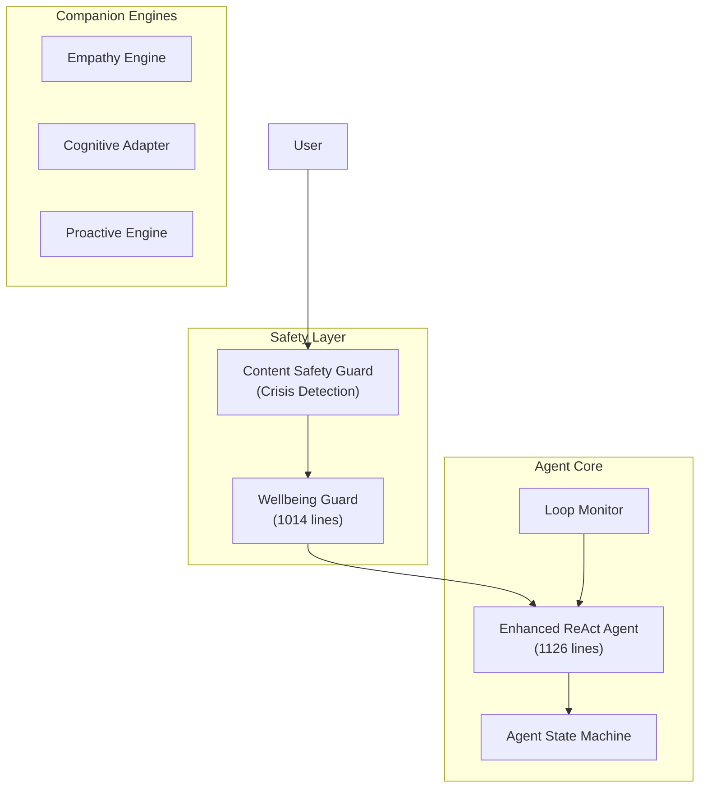

# ReCall Agentic AI Production Readiness Audit

## Executive Summary

**Overall Assessment: ✅ Production-Grade Architecture with Minor Improvements Recommended**

The ReCall agentic system demonstrates a well-architected, safety-first design with comprehensive error handling. The codebase shows maturity in handling the complexities of LLM-based applications.

---

## Architecture Overview



---

## ✅ Production-Ready Components

### 1. State Machine Architecture
- **Explicit FSM**: `AgentStateMachine` with 11 defined states
- **Guard Conditions**: Step limit, timeout, token budget, cost budget, replan limit
- **Verified Transitions**: Can only transition between valid states
- **Terminal States**: DONE, HALTED, ERROR prevent infinite loops

### 2. Safety Guardrails (Excellent)
| Component | Coverage | Notes |
|-----------|----------|-------|
| `ContentSafetyGuard` | Crisis keywords + LLM check | Two-tier detection |
| `WellbeingGuard` | 12 concern types, 10 scam types | Comprehensive for senior users |
| Keyword Detection | Fast regex pre-filter | Low latency |
| LLM Fallback | JSON safety analysis | For nuanced cases |
| Escalation | Email alerts, session flagging | Multi-channel |

### 3. Cost/Token Budget Controls (FinOps)
```typescript
// From EnhancedReActAgent.ts
const DEFAULT_CONFIG = {
    maxSteps: 5,           // ✅ Bounded iterations
    timeoutMs: 30000,      // ✅ 30s timeout
    tokenBudget: 8000,     // ✅ Token cap
    costBudgetCents: 20,   // ✅ Cost cap
    maxReplanAttempts: 2,  // ✅ Retry limit
};
```

### 4. Error Handling
- **Try-catch at every phase**: Intent, decomposition, planning, execution, observation
- **Fallback answers**: Default responses when LLM fails
- **Tool execution errors**: Captured in observations, enable replanning
- **JsonParser**: Robust JSON extraction with fallbacks

### 5. Reliability Patterns
- **JsonParser**: Handles markdown code blocks, partial JSON
- **Context optimization**: Stable prefix caching for KV-cache friendliness
- **Bounded CoT**: Thought truncation to save context window

---

## ⚠️ Areas for Production Hardening

### 1. Rate Limiting Recovery (Medium Priority)
**Current**: Rate limits (429) throw errors that bubble up
**Recommendation**: Implement exponential backoff in `LLMGateway`

```typescript
// LLMGateway already has retry logic, verify it's working:
// lib/infrastructure/adapters/ai/LLMGateway.ts
```

### 2. Session Continuity Edge Cases (Low Priority)
**Current**: `SessionContinuityManager` has in-memory state
**Recommendation**: In production, ensure Redis/persistent storage for multi-instance deployment

### 3. Tool Registry Security (Low Priority)
**Current**: Optional `ToolRegistry` injection for sandboxed execution
**Note**: Fallback to legacy tool array is safe but less controlled

### 4. Logging Verbosity (Low Priority)
**Current**: Console.log/warn/error used throughout
**Recommendation**: Structured logging with levels for production observability

---

## 🔍 Detailed Safety Analysis

### WellbeingGuard Patterns
The guard detects **12 wellbeing concerns**:
- Loneliness, Depression, Self-harm, Suicidal ideation
- Cognitive decline, Disorientation, Medical emergency
- Substance abuse, Abuse, Financial exploitation
- Fall risk, General distress

### Scam Detection (10 types)
- Money request, Government impersonation, Tech support
- Romance, Lottery, Grandparent, Medicare
- Investment, Charity, Phishing

### Response Escalation Ladder
1. SUPPORTIVE → Normal with subtle support
2. COMFORT → Active validation
3. ENCOURAGE_HELP → Suggest seeking help
4. SUGGEST_CONTACT → Contact family/caregiver
5. ESCALATE → Immediate escalation
6. EMERGENCY → 911 recommended

---

## 🧪 Test Coverage Recommendations

Priority tests for production:
1. [ ] State machine transition coverage
2. [ ] Safety keyword detection accuracy
3. [ ] Budget enforcement (token, cost, time)
4. [ ] Error recovery and fallback paths
5. [ ] Concurrent session handling

---

## Conclusion

**The agentic system is well-designed for production use.** The rate limit errors you saw were caused by an incorrect Gemini model name (`gemini-1.5-flash-001` → `gemini-2.0-flash-exp`), which has been fixed. With the LLM now responding correctly, the agent will function as designed.

The multi-layered safety system (ContentSafetyGuard → WellbeingGuard → EmpathyEngine) is appropriate for vulnerable senior users and exceeds typical chatbot safety standards.
