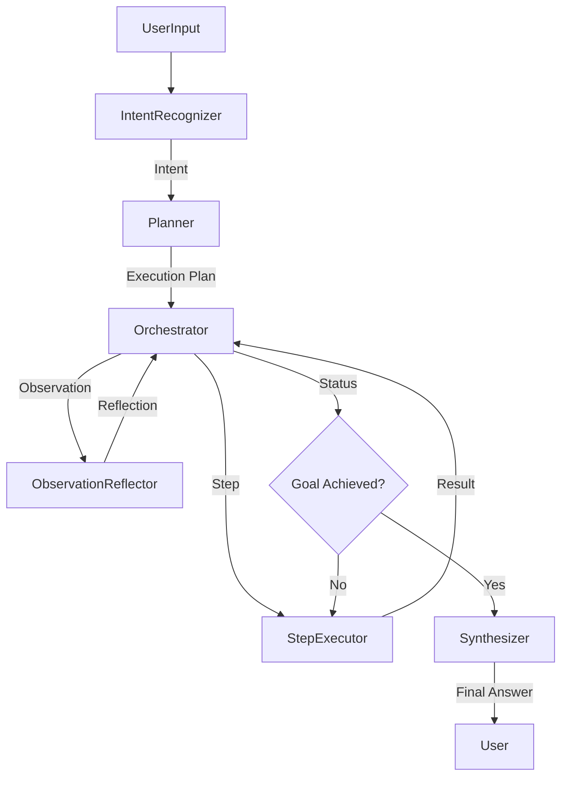

# Recall Agentic AI Architecture

## Overview

The Recall Agentic AI is designed as a **cognitive engine** that treats Large Language Models (LLMs) as reasoning engines rather than just text generators. It employs a **Reflective Action (ReAct)** loop with explicit **Algorithm of Thoughts (AoT)** planning to ensure safe, deterministic, and high-quality interactions with senior users.

## Core Philosophy

1.  **LLM as Reasoning Engine**: Logic resides in the architecture, not just the prompt.
2.  **Explicit Primitives**: We define strict interfaces for Intents, Steps, Observations, and Reflections.
3.  **Safety First**: Integration of safety checks at multiple levels (Intent, Execution, Synthesis).
4.  **Observability**: Full visibility into the agent's "thought process", cost, and latency.

## Architecture Components

### 1. Agent Primitives (`lib/core/application/agent/primitives`)
The fundamental building blocks:
-   **`IntentType`**: Standardized user intents (e.g., `RECALL_MEMORY`, `SHARE_EMOTION`).
-   **`AgentPhase`**: The lifecycle states (`RECOGNIZING_INTENT`, `PLANNING`, `EXECUTING`, etc.).
-   **`HaltReason`**: Explicit reasons for stopping execution (Safety, Budget, Success).

### 2. Orchestrator (`AgentOrchestrator.ts`)
The central brain that coordinates the lifecycle. It does NOT contain business logic but wires together:
-   **Intent Recognition** -> **Planning** -> **Execution** -> **Reflection** -> **Synthesis**.
It enforces the `AgentLoopMonitor` limits.

### 3. Intent Recognizer (`IntentRecognizer.ts`)
Classifies user input into structured intents with confidence scores. It uses specific prompts to detect if memory lookup or safety checks are required *before* any action is taken.

### 4. Planner (`EnhancedAgentPlanner.ts`)
Implements **Algorithm of Thoughts (AoT)**.
-   **Simple Plans**: For greeting/simple Q&A (1 step).
-   **Complex Plans**: Decomposes goals into `ExecutionPlan` with dependencies and contingencies.

### 5. Step Executor (`StepExecutor.ts`)
Executes the discrete steps generated by the planner.
-   Invokes `Tools` (RAG, Database, Logic).
-   Standardizes outputs into `StepResult`.
-   Calculates cost and token usage.

### 6. Observation Reflector (`ObservationReflector.ts`)
The "Critic". After steps are executed, it analyzes the observations (`ProcessedObservation`) against the original goal.
-   Decides if the goal is achieved.
-   Identifies missing information.
-   Prevents premature or hallucinatory responses.

### 7. Answer Synthesizer (`AnswerSynthesizer.ts`)
Generates the final user-facing response.
-   Takes the *validated* reflection and facts.
-   Adapts tone (empathetic, checking understanding).
-   Ensures no new information is hallucinated beyond what was observed.

## Data Flow

## Observability

The `AgentLoopMonitor` tracks every run:
-   **Cost**: Cents per step and total.
-   **Tokens**: Input/Output breakdown.
-   **Latency**: Time per phase.
-   **Limits**: Enforces strict budgets to prevent runaway costs.

## Testing & Evaluation

-   **Unit Tests**: In `tests/unit/application`.
-   **Integration Tests**: `AgentOrchestrator.test.ts` covers the full loop.
-   **Golden Datasets**: `tests/golden-datasets/` contains vetted scenarios.
-   **Eval Script**: `scripts/run-eval.ts` runs regression against golden datasets.
